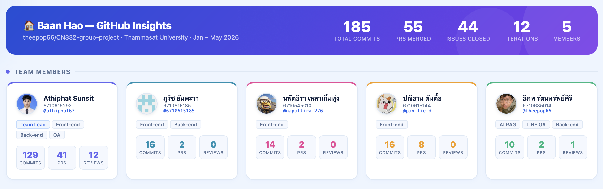
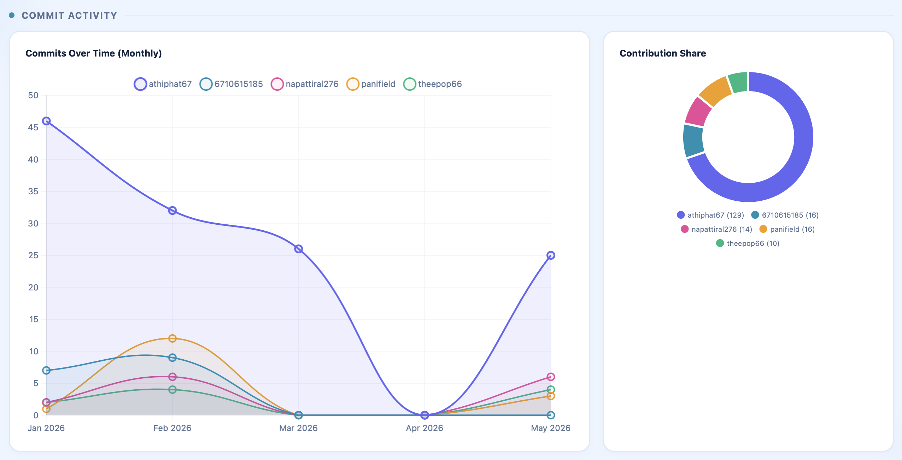
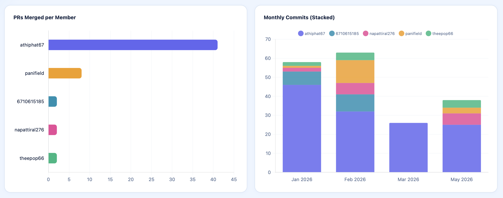
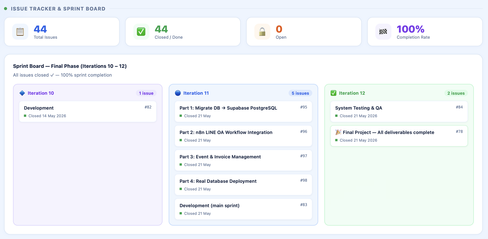
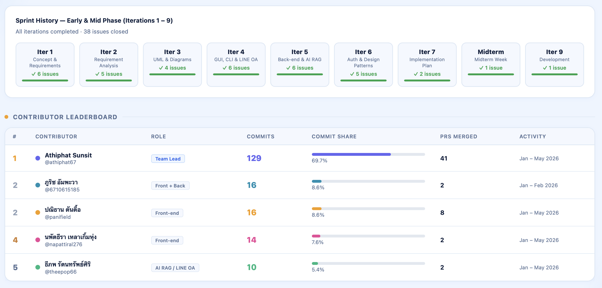

<div align="center">


# BaanHao: Smart Living Management System

**CN332 Object-Oriented Analysis and Design · Thammasat University**

[](https://github.com/theepop66/CN332-group-project/issues)
[](https://github.com/theepop66/CN332-group-project/issues?q=is%3Aissue+is%3Aclosed)
[](https://github.com/theepop66/CN332-group-project/commits)
[](https://github.com/theepop66/CN332-group-project/pulls?q=is%3Apr+is%3Aclosed)

</div>

---

## Table of Contents

1. [Project Overview](#1-project-overview)
2. [Demo](#2-demo)
3. [Key Features](#3-key-features)
4. [Technical Stack](#4-technical-stack)
5. [LINE OA Chatbot — RAG Architecture](#5-line-oa-chatbot--rag-architecture)
6. [Software Design Artifacts](#6-software-design-artifacts)
7. [Installation](#7-installation)
8. [Project Structure](#8-project-structure)
9. [Project Trackability](#9-project-trackability)
10. [Iteration Progress](#10-iteration-progress)
11. [Instructor Feedback](#11-instructor-feedback)
12. [Team Members](#12-team-members)

---

## 1. Project Overview

BaanHao is a comprehensive property management platform tailored for housing estates and condominiums. It is engineered to optimize the operational efficiency of juristic persons while significantly enhancing the residential experience.

From an administrative standpoint, the platform focuses on streamlining redundant workflows — resolving persistent issues such as repetitive handling of basic inquiries and the mismanagement of fragmented or unrecorded complaints.

For residents, BaanHao eliminates traditional communication barriers, emphasizing seamless accessibility and rapid response times.

---

## 2. Demo LineOA RAG

<video src="https://github.com/user-attachments/assets/0a7dbd1f-0d59-4476-a55e-d22e5ae873ec" controls width="100%"></video>

---

## 3. Key Features

### For Residents (via LINE Official Account)

- **RAG-Powered Q&A** — AI chatbot answers questions about community rules, fees, and regulations by retrieving information from an uploaded knowledge base (PDF/CSV) stored in a Supabase vector store, powered by Google Gemini 2.5 Flash Lite.
- **Smart Ticket (Visitor Registration)** — Residents register guests via LINE chat by providing a visitor name and license plate. The bot validates input and returns a QR code Smart Ticket automatically.
- **Complaint Filing** — Residents report issues (broken lights, water pipe leaks, noise, etc.) through the bot. AI collects subject, location, and description, classifies priority (critical / high / medium / low), and stores the complaint into the Django database — triggering an admin notification.
- **Conversational Memory** — The bot maintains a 5-turn conversation window per LINE user, enabling multi-step data collection without re-asking previous answers.

### For Juristic Person (via Web Application)

- **Dashboard** — Central command hub with real-time overview of system status, recent activities, and key operational metrics.
- **All Tasks (Complaint & Maintenance)** — Task management module categorizing resident complaints and maintenance requests. Staff can track progress, update statuses, and manage workflows.
- **Notice** — Announcement management system for creating, editing, and broadcasting community notices to residents.
- **Event** — Feature to organize, schedule, and promote community events.
- **Staff** — Role and account management for juristic personnel; administrators control access levels and responsibilities.
- **Analytics** — Data visualization tools analyzing task resolution times, frequent issues, and operational efficiency.

---

## 4. Technical Stack

### Frontend
| Technology | Usage |
|---|---|
|  | Juristic web application UI |
|  | Styling & layout |

### Backend & API
| Technology | Usage |
|---|---|
|   | REST API & server-side logic |
|  | Messaging API (LINE Official Account) |

### Database
| Technology | Usage |
|---|---|
|   | Relational DB + Vector Store (hosted on Supabase) |

### LINE OA Chatbot (AI / RAG)
| Technology | Usage |
|---|---|
|  | Workflow automation (self-hosted via Docker) |
|  | LLM `gemini-2.5-flash-lite` · Embeddings `gemini-embedding-001` |

### Tools & Management
| Technology | Usage |
|---|---|
|  | UI/UX design & prototyping |
|   | Version control & project management |

---

## 5. LINE OA Chatbot — RAG Architecture

The LINE OA chatbot is built on **n8n** (self-hosted via Docker) and uses a **RAG (Retrieval-Augmented Generation)** pipeline to answer resident inquiries from community documents.

### System Flow

```
Resident (LINE)
    │
    ▼
LINE Messaging Trigger (n8n)
    │
    ▼
AI Agent ── Google Gemini 2.5 Flash Lite (LLM)
    │     ├── Supabase Vector Store (RAG knowledge base)
    │     ├── Simple Memory (5-turn conversation window)
    │     └── Structured Output Parser (JSON intent classification)
    │
    ▼
Switch Router (by intent)
    │
    ├─── visitor ──► Send Smart Ticket QR via LINE → Save to visit_logs (Supabase)
    │
    ├─── complaint ► Save to issues_issue + issues_complaint → Notify admin dashboard
    │                └─► Reply confirmation via LINE
    │
    └─── general ──► RAG retrieval from vector store → Answer via LINE
```

### Intent Classification

| Intent | Trigger | Output |
|---|---|---|
| `visitor` | Resident wants to register a guest | Smart Ticket QR code (name + license plate) |
| `complaint` | Resident reports an issue | Stored complaint with priority + admin notification |
| `general` | Any question about village rules/info | RAG-based answer from community documents |

### RAG Knowledge Base Setup

Documents (PDF/CSV) are uploaded via an n8n web form → chunked → embedded with `gemini-embedding-001` → stored in Supabase vector store. On each user query, the AI Agent retrieves relevant chunks before generating a response.

### Integration with Django Dashboard

All data from LINE interactions flows directly into the Django database (Supabase PostgreSQL):

- Complaints appear in the **All Tasks** module with priority labels
- Visitor logs are stored in the `visit_logs` table
- Admin receives in-app notifications for every new complaint

### Setup

```bash
cd n8n-LineOA
cp .env.example .env   # fill in LINE token, Gemini API key, Supabase credentials
docker compose up -d   # starts n8n at http://localhost:5678
# Import workflows/lineOArag.json in n8n UI → Activate
```

---

## 6. Software Design Artifacts

### UML Diagrams
- **Use Case Diagram:** [📊 View Use Case Diagrams](Documents/Usecase_Diagram/)
- **Class Diagram:** [📊 BaanHao Class Diagram (PDF)](Documents/Database_Diagram/BaanHao_Diagram\(version-1\).pdf)

### Database Design
- **Entity Relationship Diagram (ERD):** [📊 BaanHao Database Diagram (PDF)](Documents/Database_Diagram/BaanHao_Diagram\(version-1\).pdf) *(Covered in Class Diagram)*

### UI / UX Design
- **Website Mockups:** [🖼️ View Website Mockups](Documents/Iteration4/website/)
- **LINE OA Mockup:** [📱 LINE OA Chatbot Mockup](Documents/Iteration4/LineOA/LineOA_Chatbot.png)

---

## 7. Installation

### Prerequisites

- **Git**
- **Python 3.10+**
- **Terminal**

### Step-by-Step

**1. Clone the repository**
```bash
git clone https://github.com/theepop66/CN332-group-project.git CN332
cd CN332/myproject
```

**2. Create and activate a virtual environment**
```bash
# macOS / Linux
python3 -m venv venv
source venv/bin/activate

# Windows
python -m venv venv
venv\Scripts\activate
```

**3. Install dependencies**
```bash
pip install -r requirement.txt
```

**4. Configure environment variables**
```bash
# Copy the example file and fill in your credentials
cp baanhao_project/.env.example baanhao_project/.env
```

**5. Run database migrations**
```bash
cd baanhao_project
python manage.py migrate
```

**6. Start the development server**
```bash
python manage.py runserver
# Visit http://127.0.0.1:8000/
```

**7. Test credentials**
```
Username : admin
Password : admin12345
```

---

## 8. Project Structure

```
CN332-group-project/
├── BaanHao_CLI/                  # Command Line Interface module
├── Documents/                    # All project documentation and assets
│   ├── Database_Diagram/         # Class diagram & database design
│   ├── Iteration1/               # Week 1 — Concept paper & slides
│   ├── Iteration2/               # Week 2 — Requirement analysis
│   ├── Iteration3/               # Week 3 — Use case & class diagrams
│   ├── Iteration4/               # Week 4 — UI mockups & LINE OA screenshots
│   ├── Iteration5-7/             # Weeks 5-7 — Design patterns & implementation
│   ├── Usecase_Diagram/          # System use case diagram images
│   ├── image_project_track/      # GitHub Insights dashboard screenshots
│   └── LOGO/                     # Project logo files
├── myproject/                    # Main source code
│   ├── baanhao_project/
│   │   ├── analytics/            # Data processing & statistics app
│   │   ├── baanhao_project/      # Django core config (settings.py, urls.py)
│   │   ├── complaints/           # Resident complaint management app
│   │   ├── dashboard/            # Juristic admin dashboard app
│   │   ├── issues/               # General issues & ticketing app
│   │   ├── maintenance/          # Maintenance request management app
│   │   ├── notifications/        # Notification system & LINE API integration
│   │   ├── properties/           # Property & asset management app
│   │   ├── users/                # User management & authentication app
│   │   ├── static/               # CSS, JavaScript, images
│   │   ├── templates/            # HTML templates (frontend UI)
│   │   └── manage.py             # Django CLI utility
│   └── requirement.txt           # Python dependencies
├── n8n-LineOA/                   # n8n LINE OA RAG workflow
├── github-insights.html          # GitHub Insights dashboard (static)
└── README.md
```

---

## 9. Project Trackability

Our team uses **GitHub Projects** (Kanban Board) to manage tasks, sprints, and overall project progress following Agile methodologies.

- **Project Board:** [View Kanban Board](https://github.com/users/theepop66/projects/3/views/3)
- **GitHub Insights Dashboard:** [📊 View Full Dashboard](github-insights.html)

### Project Status


### GitHub Insights Dashboard Preview











### Contributor Summary

| Team Member | Role | Commits | PRs Merged | Issues |
| :--- | :--- | :---: | :---: | :---: |
| [@athiphat67](https://github.com/athiphat67) | Team Lead · Front-end · Back-end · QA | **129** | **41** | 44 ✅ |
| [@6710615185](https://github.com/6710615185) | Front-end · Back-end | 16 | 2 | — |
| [@panifield](https://github.com/panifield) | Front-end | 16 | 8 | — |
| [@napattiral276](https://github.com/napattiral276) | Front-end | 14 | 2 | — |
| [@theepop66](https://github.com/theepop66) | AI RAG · LINE OA · Back-end | 10 | 2 | — |
| **Total** | | **185** | **55** | **44 / 44 (100%)** |

> Last updated 22 May 2026 — All 44 issues closed across 12 iterations · 100% completion

---

## 10. Iteration Progress

| Iteration | Topic | Documents & Slides | Presented |
| :---: | :--- | :--- | :---: |
| **1** | Concept Paper | [📄 Concept Paper](Documents/Iteration1/hm1_CONCEPT_PAPER.pdf) · [📊 Slides](Documents/Iteration1/iteration1-BaanHao.pdf) | — |
| **2** | Requirements Analysis | [📄 การแจกแจง Requirement](Documents/Iteration2/hm2_การแจกแจงrequirement.pdf) · [📊 Slides](Documents/Iteration2/iteration2-BaanHao.pdf) | — |
| **3** | UML Diagrams | [🎨 Canva](https://www.canva.com/design/DAG-12vJwHI/FFv4AjDZGIT0hqmoKelIXQ/view) · [📊 Slides](Documents/Iteration3/Iteration3_BannHao.pdf) | 26/01/2026 |
| **4** | GUI & LINE OA Demo | [🎥 GUI Walkthrough](https://youtu.be/igLxI9eYJGI?si=iCysm1rsU2UA-4bB) · [📱 LINE OA Demo](https://youtube.com/shorts/j89uEZ3Yu6c?feature=share) | — |
| **5** | Facade Pattern & Back-end | [📊 Slides](https://www.canva.com/design/DAHAvvavFFM/HOUiDaKPhY2ek7LEpf9VWA/view) · [📄 PDF](Documents/Iteration5-7/BaanHao-Iteration5-7.pdf) | — |
| **6** | Login Interface & Adapter Pattern | [📊 Slides](https://www.canva.com/design/DAHBRznlkXk/oznuqUfk21gcsGM5xwXzZg/edit) · [📄 PDF](Documents/Iteration5-7/BaanHao-Iteration5-7.pdf) | — |
| **7** | Implementation Plan | [📊 Slides](https://www.canva.com/design/DAHDLQnATVE/9BKB05CxdQyN2q5MyVqCfg/edit) · [📄 PDF](Documents/Iteration5-7/BaanHao-Iteration5-7.pdf) | — |
| **8 – 9** | Development | [📄 Iteration 5-7 PDF](Documents/Iteration5-7/BaanHao-Iteration5-7.pdf) | — |
| **10 – 11** | Development & Integration | [🎥 GUI Walkthrough](https://youtu.be/igLxI9eYJGI?si=iCysm1rsU2UA-4bB) · [📱 LINE OA Demo](https://youtube.com/shorts/j89uEZ3Yu6c?feature=share) | — |
| **12 — Final** | System Testing & Final Presentation | [📄 Final Presentation](Documents/Final_Presentation_CN332.pdf) · [📊 Use Case](Documents/Usecase_Diagram/) · [📊 Class Diagram](Documents/Database_Diagram/BaanHao_Diagram\(version-1\).pdf) | 18/05/2026 |

---

## 11. Instructor Feedback

> [!IMPORTANT]
> **Date: 26/01/2026 (Iteration 1–3)**
> - **Comment:** ให้ดูตัวอย่างการสืบทอด Class (Inheritance) ที่ยืดหยุ่นมากขึ้น เพื่อให้ Code Clean และจัดการ Logic ได้ง่ายขึ้น

---

## 12. Team Members

| Student ID | Name | GitHub | Roles |
| :---: | :--- | :--- | :--- |
| `6710615292` | Athiphat Sunsit | [@athiphat67](https://github.com/athiphat67) | Team Lead · Front-end · Back-end · QA |
| `6710615185` | ภูริช อัมพะวา | [@6710615185](https://github.com/6710615185) | Front-end · Back-end |
| `6710545010` | นพัตธีรา เหลาเกิ้มหุ่ง | [@napattiral276](https://github.com/napattiral276) | Front-end |
| `6710615144` | ปณิธาน ตันตื้อ | [@panifield](https://github.com/panifield) | Front-end |
| `6710685014` | ธีภพ รัตนทรัพย์ศิริ | [@theepop66](https://github.com/theepop66) | AI RAG · LINE OA · Back-end |
