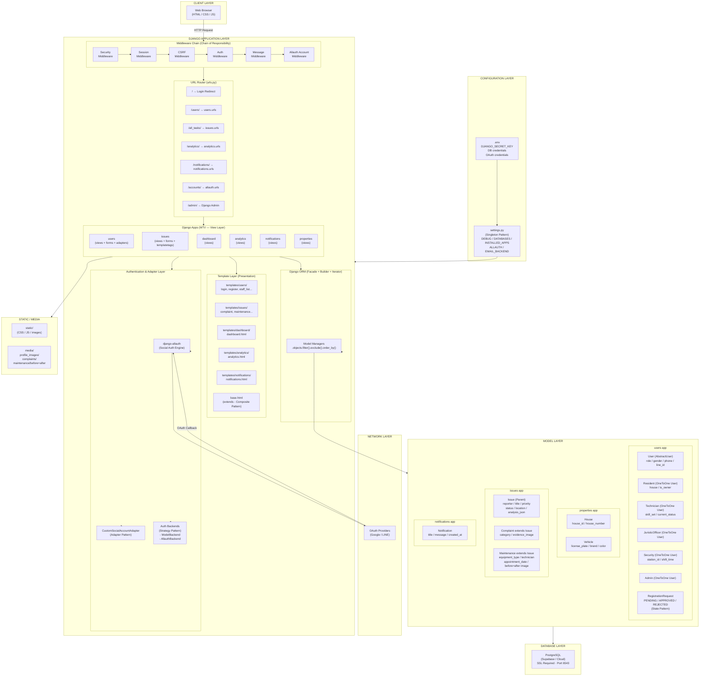
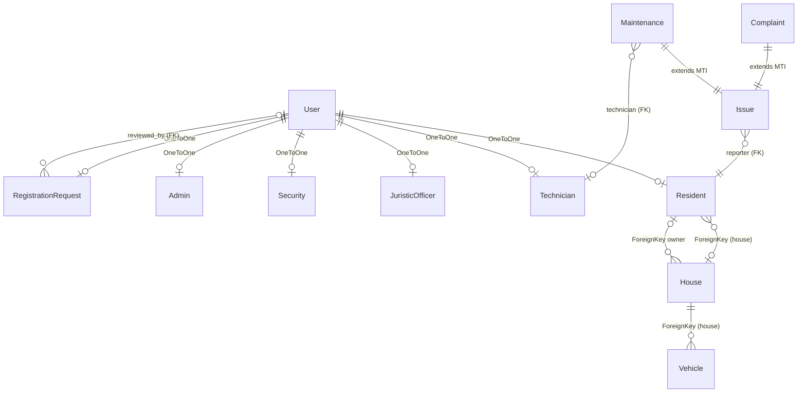
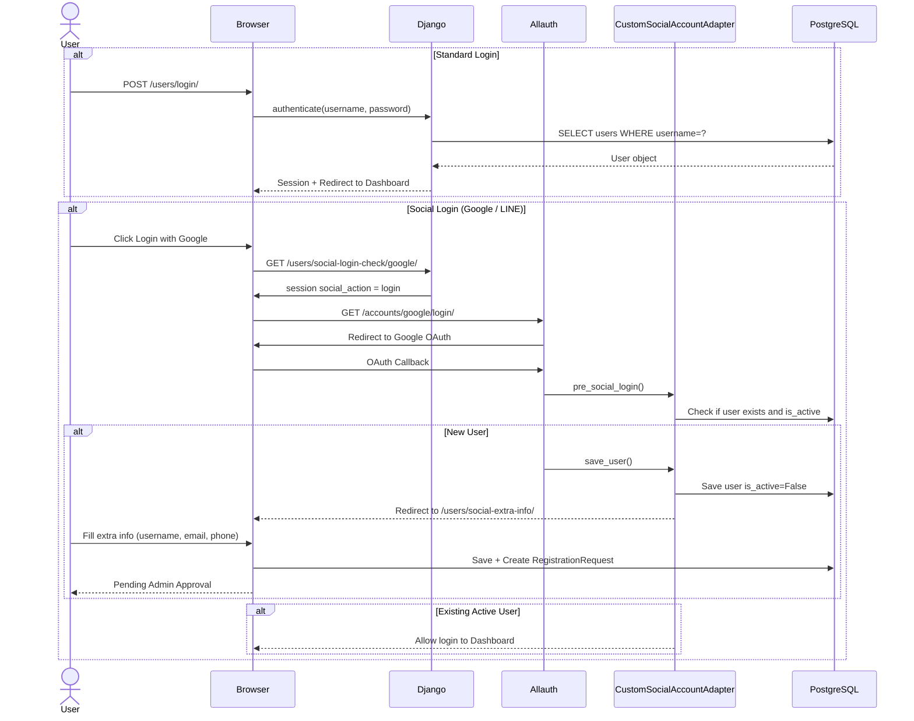
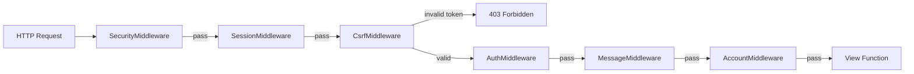
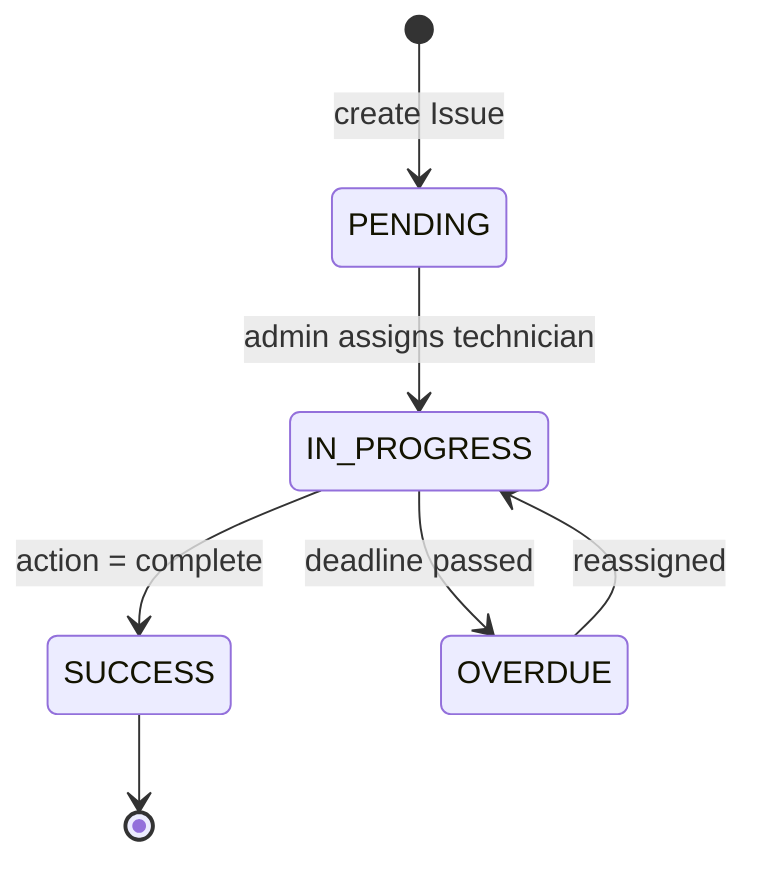

# BaanHao Project — Architecture & Design Patterns

> **Stack:** Django 5.2 · Python · PostgreSQL · django-allauth  
> **Pattern:** MTV (Model–Template–View) — Django's variant of MVC

---

## 1. System Layers Overview



---

## 2. Django App Responsibilities

| App | Responsibility | Key Files |
|-----|---------------|-----------|
| **`users`** | Auth, Registration flow, Role management, Admin approval, Social login | `models.py`, `views.py`, `forms.py`, `adapters.py` |
| **`properties`** | House & Vehicle registry | `models.py` |
| **`issues`** | Complaint & Maintenance request lifecycle | `models.py`, `views.py`, `forms.py` |
| **`dashboard`** | Main landing page after login | `views.py` |
| **`analytics`** | Reporting & statistics view | `views.py` |
| **`notifications`** | System notifications | `models.py`, `views.py` |

---

## 3. Data Model Relationships



---

## 4. Authentication Flow



---

## 5. Request Lifecycle (Middleware → View → Response)

```mermaid
flowchart LR
    Req["HTTP Request"]
    --> SM["SecurityMiddleware\n(HTTPS, headers)"]
    --> SesM["SessionMiddleware\n(load session)"]
    --> CSRF["CsrfViewMiddleware\n(validate token)"]
    --> AuthM["AuthenticationMiddleware\n(attach request.user)"]
    --> MsgM["MessageMiddleware\n(flash messages)"]
    --> AlM["AccountMiddleware\n(allauth hooks)"]
    --> URL["URL Router"]
    --> View["View Function"]
    --> Template["Template Engine"]
    --> Resp["HTTP Response"]
```



---

## 6. Design Patterns

### 6.1 Creational Patterns

---

#### Singleton

> **ใช้ใน:** `baanhao_project/settings.py`

`settings.py` ถูก Python import system โหลดครั้งเดียวเท่านั้น ทุก app ที่ทำ `from django.conf import settings` จะได้รับ object เดียวกันเสมอ ไม่มีการสร้าง instance ซ้ำ ทำให้ config ทั้งระบบ (database, secret key, installed apps) เป็น single source of truth

```python
# baanhao_project/settings.py
import os
from dotenv import load_dotenv

load_dotenv()

SECRET_KEY = os.environ.get('DJANGO_SECRET_KEY', 'django-insecure-fallback-key-for-dev')

DATABASES = {
    'default': {
        'ENGINE': 'django.db.backends.postgresql',
        'NAME': os.environ.get('DB_NAME'),
        'USER': os.environ.get('DB_USER'),
        ...
    }
}

INSTALLED_APPS = [
    'django.contrib.admin',
    'users',
    'properties',
    'issues',
    ...
]
```

```python
# การใช้งานใน views/models ทุกที่ — อ้างอิง object เดียวกันเสมอ
from django.conf import settings
print(settings.DEBUG)  # ได้ค่าจาก settings.py instance เดียว
```

---

#### Abstract Factory

> **ใช้ใน:** `users/models.py` — `AbstractUser` + Role-specific profile models

`User(AbstractUser)` ทำหน้าที่เป็น abstract base ที่กำหนด interface กลาง ส่วน `Resident`, `Technician`, `JuristicOfficer`, `Security`, `Admin` แต่ละ class เป็น concrete product ที่ถูกสร้างโดย factory เดียวกัน (Django ORM) แต่ได้ object ที่มี attributes ต่างกันตาม role

```python
# users/models.py
class User(AbstractUser):
    # Abstract base — กำหนด interface กลางสำหรับทุก role
    role = models.CharField(max_length=20, choices=UserRole.choices, default=UserRole.RESIDENT)
    phone_number = models.CharField(max_length=15, unique=True, null=True, blank=True)
    line_id = models.CharField(max_length=50, unique=True, null=True, blank=True)

# Concrete Products — แต่ละ role มี attributes เฉพาะของตัวเอง
class Resident(models.Model):
    user = models.OneToOneField(User, on_delete=models.CASCADE, related_name='resident_profile')
    house = models.ForeignKey('properties.House', on_delete=models.SET_NULL, ...)
    is_owner = models.BooleanField(default=False)

class Technician(models.Model):
    user = models.OneToOneField(User, on_delete=models.CASCADE, related_name='technician_profile')
    skill_set = models.TextField()
    current_status = models.CharField(max_length=20, default="AVAILABLE")

class JuristicOfficer(models.Model):
    user = models.OneToOneField(User, on_delete=models.CASCADE, related_name='juristic_profile')
    officer_id = models.CharField(max_length=20, unique=True)
    department = models.CharField(max_length=100)
```

```python
# users/views.py — Factory สร้าง User object ที่ถูก role
user = User.objects.create_user(
    username=form.cleaned_data['username'],
    email=form.cleaned_data['email'],
    role=UserRole.RESIDENT,   # กำหนด product type
    is_active=False,
)
RegistrationRequest.objects.create(user=user)  # สร้าง related object ควบคู่กัน
```

---

#### Builder

> **ใช้ใน:** `issues/views.py`, `users/views.py` — Django QuerySet API

Django QuerySet ใช้ Builder Pattern โดย method แต่ละตัว (`.filter()`, `.exclude()`, `.select_related()`, `.order_by()`) return QuerySet ใหม่แทนการแก้ไข object เดิม ทำให้สามารถ chain ได้อย่างยืดหยุ่น และ build query ทีละขั้นตามเงื่อนไข

```python
# issues/views.py — สร้าง query ทีละขั้น เพิ่ม filter ตามเงื่อนไข
def all_tasks(request):
    # ขั้นที่ 1: Base query
    task_list = Issue.objects.all().select_related('reporter').order_by('-created_date')

    # ขั้นที่ 2: เพิ่ม filter ถ้ามี search query
    search_query = request.GET.get('q')
    if search_query:
        task_list = task_list.filter(
            Q(title__icontains=search_query) |
            Q(location__icontains=search_query) |
            Q(description__icontains=search_query)
        )

    # ขั้นที่ 3: เพิ่ม filter ตาม status tab
    status_filter = request.GET.get('status')
    if status_filter == 'waiting':
        task_list = task_list.filter(status=IssueStatus.PENDING)
    elif status_filter == 'in_process':
        task_list = task_list.filter(status=IssueStatus.IN_PROGRESS)

    # ขั้นที่ 4: สร้าง final result
    paginator = Paginator(task_list, 30)
    page_obj = paginator.get_page(request.GET.get('page'))
```

```python
# issues/views.py — Builder ใน maintenance view (เพิ่ม .select_related หลาย level)
tasks = Maintenance.objects.select_related('issue_ptr', 'reporter', 'technician') \
                           .order_by('-created_date')
```

---

### 6.2 Structural Patterns

---

#### Adapter

> **ใช้ใน:** `users/adapters.py` — `CustomSocialAccountAdapter`

`CustomSocialAccountAdapter` แปลง interface ของ `DefaultSocialAccountAdapter` (จาก django-allauth) ให้เข้ากับ workflow ของ BaanHao ที่ต้องการขั้นตอน admin approval ก่อน login ได้ โดยไม่ต้องแก้ไข library ต้นทาง

```python
# users/adapters.py
from allauth.socialaccount.adapter import DefaultSocialAccountAdapter
from allauth.exceptions import ImmediateHttpResponse

class CustomSocialAccountAdapter(DefaultSocialAccountAdapter):
    """
    Adaptee: DefaultSocialAccountAdapter (allauth library)
    Adapter: CustomSocialAccountAdapter (BaanHao custom logic)
    Target interface: BaanHao's approval-based registration flow
    """

    def is_open_for_signup(self, request, sociallogin):
        # แปลง behavior: บล็อก signup ถ้า user มาจาก login page
        if request.session.pop('social_action', None) == 'login':
            messages.error(request, "You don't have an account yet. Please sign up first.")
            raise ImmediateHttpResponse(redirect('users:login'))
        return True

    def populate_user(self, request, sociallogin, data):
        # แปลง behavior: จัดการ email conflict ที่ allauth ไม่รองรับ
        user = super().populate_user(request, sociallogin, data)
        if user.email and User.objects.filter(email=user.email).exists():
            user.email = f'{sociallogin.account.uid}@placeholder.local'
            sociallogin.email_addresses = []
        return user

    def save_user(self, request, sociallogin, form=None):
        # แปลง behavior: แทนที่จะ login เลย ให้ redirect ไป extra info form
        user = super().save_user(request, sociallogin, form)
        user.is_active = False
        user.role = UserRole.RESIDENT
        user.save()
        request.session['social_signup_user_id'] = user.id
        raise ImmediateHttpResponse(redirect('users:social_extra_info'))

    def pre_social_login(self, request, sociallogin):
        # แปลง behavior: ตรวจสอบ user ที่มีอยู่แล้วก่อน allauth ดำเนินการต่อ
        user = sociallogin.user
        if not user.pk:
            return
        if not user.is_active:
            messages.info(request, "Your registration is pending admin approval.")
            raise ImmediateHttpResponse(redirect('users:register'))
```

```python
# baanhao_project/settings.py — ลงทะเบียน Adapter
SOCIALACCOUNT_ADAPTER = 'users.adapters.CustomSocialAccountAdapter'
```

---

#### Facade

> **ใช้ใน:** Django ORM + `BaanHao_CLI/task_manager.py` + `BaanHao_CLI/utils.py`

Facade ซ่อนความซับซ้อนของ subsystem ไว้เบื้องหลัง interface เดียวที่ใช้งานง่าย

**Facade 1 — Django ORM ซ่อน SQL:**

```python
# issues/views.py — เรียกแค่นี้ แต่เบื้องหลังมี SQL JOIN หลายตาราง
tasks = Maintenance.objects.select_related('issue_ptr', 'reporter', 'technician') \
                           .order_by('-created_date')

# SQL จริงที่ Django สร้างให้เบื้องหลัง (ไม่ต้องเขียนเอง):
# SELECT issues_maintenance.*, issues_issue.*, users_resident.*,
#        users_technician.* FROM issues_maintenance
#        INNER JOIN issues_issue ON (...)
#        LEFT OUTER JOIN users_resident ON (...)
#        LEFT OUTER JOIN users_technician ON (...)
#        ORDER BY issues_issue.created_date DESC
```

**Facade 2 — `manage_tasks_menu()` ซ่อน sub-operations ของ CLI:**

```python
# BaanHao_CLI/task_manager.py
def manage_tasks_menu(tasks, user):
    # Facade: entry point เดียวที่ routing ไปหา operations ทั้งหมด
    # client (main.py) ไม่จำเป็นต้องรู้ว่ามี view/search/add/update/delete อยู่ข้างใน
    if choice == "1": view_all_tasks(tasks)
    elif choice == "2": search_task(tasks)
    elif choice == "3": add_task(tasks)
    elif choice == "4": update_task(tasks, user)
    elif choice == "5": delete_task(tasks, user)
```

```python
# BaanHao_CLI/main.py — client ใช้แค่ facade เดียว
from task_manager import manage_tasks_menu

if choice == "1":
    manage_tasks_menu(tasks_list, current_user)  # ไม่รู้ implementation ข้างใน
```

---

#### Composite

> **ใช้ใน:** Django Template inheritance + URL routing

Template ใช้โครงสร้าง Composite ที่ `base.html` เป็น root component มี `` เป็น leaf slots และ child templates แต่ละอันเป็น component ที่ extends ได้อีก

```html
<!-- templates/base.html — Root composite component -->
<!DOCTYPE html>
<html>
<head></head>
<body>
    
       <!-- leaf slot -->
    
</body>
</html>
```

```html
<!-- templates/issues/all_tasks.html — Child component ที่ composite เข้ากับ base -->



    <div class="task-list">
        
            <div class="task-card">{{ task.title }}</div>
        
    </div>

```

URL routing ก็ใช้ Composite ด้วย — root `urls.py` รวม sub-URLs จากทุก app เข้าด้วยกัน:

```python
# baanhao_project/urls.py
urlpatterns = [
    path('users/', include('users.urls')),       # composite: users app URLs
    path('issues/', include('issues.urls')),      # composite: issues app URLs
    path('accounts/', include('allauth.urls')),   # composite: allauth URLs
    path('admin/', admin.site.urls),
]
```

---

#### Decorator

> **ใช้ใน:** `users/views.py` — `@login_required`

Python Decorator เพิ่ม behavior (ตรวจสอบ authentication) ให้ view function โดยไม่แก้ไข function เดิม สามารถ stack หลาย decorator ได้

```python
# users/views.py
from django.contrib.auth.decorators import login_required

@login_required   # Decorator: ถ้ายังไม่ login → redirect ไป login page อัตโนมัติ
def pending_registrations_view(request):
    if request.user.role != UserRole.ADMIN and not request.user.is_superuser:
        messages.error(request, 'คุณไม่มีสิทธิ์เข้าถึงหน้านี้')
        return redirect('dashboard')
    pending = RegistrationRequest.objects.filter(status=RequestStatus.PENDING)
    return render(request, 'users/pending_registrations.html', {'pending_requests': pending})

@login_required   # Stack หลาย view ด้วย decorator เดียวกัน
def approve_registration_view(request, request_id):
    ...

@login_required
def reject_registration_view(request, request_id):
    ...

@login_required
def dashboard(request):
    return render(request, 'dashboard/dashboard.html')
```

---

#### Proxy

> **ใช้ใน:** Django QuerySet (Lazy Evaluation) + Multi-Table Inheritance

**Proxy 1 — Lazy QuerySet:** `Issue.objects.all()` คืน QuerySet object ที่เป็น proxy แทน database result จริง ไม่ยิง SQL จนกว่าจะมีการ iterate หรือ evaluate จริงๆ

```python
# issues/views.py
# บรรทัดนี้ยังไม่ยิง SQL เลย — QuerySet เป็น proxy รอ evaluate
task_list = Issue.objects.all().select_related('reporter').order_by('-created_date')

# ยังเป็น proxy อยู่ แค่เพิ่มเงื่อนไขใน query plan
if search_query:
    task_list = task_list.filter(Q(title__icontains=search_query))

# SQL ยิงจริงที่บรรทัดนี้ เมื่อ Paginator ต้องการข้อมูลจริง
paginator = Paginator(task_list, 30)
page_obj = paginator.get_page(page_number)
```

**Proxy 2 — MTI `issue_ptr`:** Django Multi-Table Inheritance สร้าง `issue_ptr` เป็น pointer/proxy จาก `Complaint`/`Maintenance` ไปยัง `Issue` parent table

```python
# issues/models.py — MTI สร้าง proxy link อัตโนมัติ
class Issue(models.Model):
    title = models.CharField(max_length=200)
    status = models.CharField(max_length=20, choices=IssueStatus.choices)
    reporter = models.ForeignKey('users.Resident', ...)

class Complaint(Issue):       # Django สร้าง complaint.issue_ptr → FK ไปยัง Issue table
    category = models.CharField(max_length=50, choices=Category.choices)
    evidence_image = models.ImageField(...)

# views.py — เข้าถึง Issue fields ผ่าน Complaint proxy ได้โดยตรง
tasks = Complaint.objects.select_related('issue_ptr', 'reporter').order_by('-created_date')
for task in tasks:
    print(task.title)   # เข้าถึง Issue.title ผ่าน issue_ptr proxy
    print(task.category)  # Complaint field เอง
```

---

### 6.3 Behavioral Patterns

---

#### Strategy

> **ใช้ใน:** `BaanHao_CLI/task_manager.py` + `baanhao_project/settings.py`

Strategy Pattern ให้เลือก algorithm ที่ใช้ได้ตาม context โดยไม่ต้องเปลี่ยน code หลัก

**Strategy 1 — Role-based access ใน CLI:**

```python
# BaanHao_CLI/task_manager.py
def manage_tasks_menu(tasks, user):
    if choice in ["3", "4", "5"]:
        if user["role"] == "admin":
            # Strategy: Admin — ใช้ CRUD operations
            if choice == "3":
                add_task(tasks)       # Write strategy
            elif choice == "4":
                update_task(tasks, user)  # Update strategy
            elif choice == "5":
                delete_task(tasks, user)  # Delete strategy
        else:
            # Strategy: Staff — ใช้ Read-only operation
            print("Access Denied: ท่านไม่มีสิทธิ์ในการแก้ไขข้อมูล (View Only)")
```

**Strategy 2 — Authentication backends:**

```python
# baanhao_project/settings.py — เลือก strategy ที่ใช้ authenticate user
AUTHENTICATION_BACKENDS = [
    'django.contrib.auth.backends.ModelBackend',        # Strategy A: username/password
    'allauth.account.auth_backends.AuthenticationBackend',  # Strategy B: social login
]
# Django จะลอง authenticate ด้วย backend ตาม order นี้
```

---

#### Template Method

> **ใช้ใน:** `users/adapters.py` — `CustomSocialAccountAdapter`

Template Method กำหนด skeleton ของ algorithm ไว้ใน base class และให้ subclass override ขั้นตอนเฉพาะส่วนที่ต้องการเปลี่ยน

```python
# users/adapters.py
class CustomSocialAccountAdapter(DefaultSocialAccountAdapter):
    """
    DefaultSocialAccountAdapter (allauth) กำหนด social login algorithm skeleton:
      1. is_open_for_signup()  → ตรวจสอบอนุญาต signup ไหม
      2. populate_user()       → สร้าง user object จากข้อมูล provider
      3. save_user()           → บันทึก user ลง database
      4. pre_social_login()    → hook ก่อน login สำเร็จ

    CustomSocialAccountAdapter override แต่ละขั้นตอนเพื่อใส่ BaanHao logic:
    """

    # Override step 1: บล็อก signup จาก login page
    def is_open_for_signup(self, request, sociallogin):
        if request.session.pop('social_action', None) == 'login':
            messages.error(request, "You don't have an account yet. Please sign up first.")
            raise ImmediateHttpResponse(redirect('users:login'))
        return True  # อนุญาต signup จาก register page

    # Override step 2: จัดการ email conflict
    def populate_user(self, request, sociallogin, data):
        user = super().populate_user(request, sociallogin, data)  # เรียก base logic ก่อน
        if user.email and User.objects.filter(email=user.email).exists():
            user.email = f'{sociallogin.account.uid}@placeholder.local'  # แก้ conflict
        return user

    # Override step 3: redirect ไป extra info แทน login ตรง
    def save_user(self, request, sociallogin, form=None):
        user = super().save_user(request, sociallogin, form)
        user.is_active = False   # ต้องรอ admin อนุมัติ
        user.save()
        request.session['social_signup_user_id'] = user.id
        raise ImmediateHttpResponse(redirect('users:social_extra_info'))

    # Override step 4: ตรวจสอบ existing user ก่อน allauth ดำเนินการ
    def pre_social_login(self, request, sociallogin):
        user = sociallogin.user
        if not user.pk:
            return  # ปล่อยให้ signup flow จัดการ
        if not user.is_active:
            messages.info(request, "Your registration is pending admin approval.")
            raise ImmediateHttpResponse(redirect('users:register'))
```

---

#### Chain of Responsibility

> **ใช้ใน:** `baanhao_project/settings.py` — Django Middleware stack

Request ถูกส่งผ่าน middleware แต่ละตัวตามลำดับ แต่ละตัวมีโอกาสดำเนินการกับ request และส่งต่อไปตัวถัดไป หรือ return response เองได้เลย (short-circuit)

```python
# baanhao_project/settings.py
MIDDLEWARE = [
    # Handler 1: ตรวจสอบ HTTPS, เพิ่ม security headers
    'django.middleware.security.SecurityMiddleware',

    # Handler 2: โหลด/บันทึก session data
    'django.contrib.sessions.middleware.SessionMiddleware',

    # Handler 3: ตรวจสอบ CORS headers
    'django.middleware.common.CommonMiddleware',

    # Handler 4: validate CSRF token — ถ้า invalid จะ return 403 เลย ไม่ส่งต่อ
    'django.middleware.csrf.CsrfViewMiddleware',

    # Handler 5: ผูก request.user จาก session
    'django.contrib.auth.middleware.AuthenticationMiddleware',

    # Handler 6: เก็บ flash messages ระหว่าง request
    'django.contrib.messages.middleware.MessageMiddleware',

    # Handler 7: ป้องกัน clickjacking (X-Frame-Options header)
    'django.middleware.clickjacking.XFrameOptionsMiddleware',

    # Handler 8: allauth hooks (สุดท้ายสุด)
    'allauth.account.middleware.AccountMiddleware',
]
```



---

#### Command

> **ใช้ใน:** `BaanHao_CLI/task_manager.py`

Command Pattern แยก operation แต่ละอย่างออกเป็น function อิสระ ทำให้ caller (`manage_tasks_menu`) ไม่ต้องรู้ implementation ของแต่ละ command

```python
# BaanHao_CLI/task_manager.py

# Command 1: View all tasks
def view_all_tasks(tasks):
    header("All Maintenance Tasks")
    format_table_header()
    for t in tasks:
        icon = "🟡" if t["status"] == "Waiting" else "🟠" if t["status"] == "In progress" else "✅"
        print(f"{t['id']:<10} | {t['type']:<10} | {icon} {t['status']:<12} | {t['assignee']}")

# Command 2: Search task
def search_task(tasks):
    query = input("Enter Task ID or Type to search: ")
    found = [t for t in tasks if query.lower() in t["id"].lower() or query in t["type"]]
    for t in found:
        print(f"Found: [{t['id']}] {t['type']} | Status: {t['status']}")

# Command 3: Add task
def add_task(tasks):
    new_id = f"{cat}/{int(time.time()) % 10000}"
    tasks.append({"id": new_id, "type": t_type, "status": "Waiting", ...})

# Command 4: Update task status
def update_task(tasks, user):
    status_map = {"1": "Waiting", "2": "In progress", "3": "Overdue", "4": "Complete"}
    target["status"] = status_map[s_choice]

# Command 5: Delete task
def delete_task(tasks, user):
    tasks.remove(target_item)

# Invoker — เลือก command ตาม user input
def manage_tasks_menu(tasks, user):
    if choice == "1":   view_all_tasks(tasks)     # invoke ViewCommand
    elif choice == "2": search_task(tasks)         # invoke SearchCommand
    elif choice == "3": add_task(tasks)            # invoke AddCommand
    elif choice == "4": update_task(tasks, user)   # invoke UpdateCommand
    elif choice == "5": delete_task(tasks, user)   # invoke DeleteCommand
```

---

#### Iterator

> **ใช้ใน:** `issues/views.py`, `users/views.py`, `notifications/views.py` — Django `Paginator`

Iterator Pattern ให้ traverse collection โดยไม่ต้องรู้โครงสร้างภายใน Django `Paginator` และ QuerySet implement built-in Python iterator protocol (`__iter__`, `__next__`)

```python
# issues/views.py — Paginator เป็น iterator ที่แบ่ง collection เป็น pages
def all_tasks(request):
    task_list = Issue.objects.all().order_by('-created_date')  # collection

    paginator = Paginator(task_list, 30)          # สร้าง iterator ที่แบ่ง 30 ต่อหน้า
    page_number = request.GET.get('page')
    page_obj = paginator.get_page(page_number)    # ดึง page ปัจจุบัน

    for task in page_obj:                         # iterate ผ่าน page
        item = {'id': task.id, 'title': task.title, ...}
        final_tasks.append(item)
```

```python
# users/views.py — Iterator ใน staff list
def staff_list(request):
    staff_users = User.objects.exclude(role=UserRole.RESIDENT).order_by('role', 'first_name')
    paginator = Paginator(staff_users, 8)         # 8 คนต่อหน้า
    page_obj = paginator.get_page(request.GET.get('page'))
    return render(request, 'users/staff_list.html', {'staffs': page_obj})
```

```html
<!-- template — iterate ผ่าน page_obj โดยไม่รู้ว่า data มาจาก QuerySet หรือ list -->

    <div class="staff-card">{{ staff.username }}</div>


<!-- pagination controls -->

    <a href="?page={{ staffs.previous_page_number }}">Previous</a>

```

---

#### State

> **ใช้ใน:** `issues/models.py` + `issues/views.py` — `IssueStatus` / `RequestStatus`

State Pattern ทำให้ object เปลี่ยน behavior ตาม state ปัจจุบัน ใน BaanHao แต่ละ Issue มี lifecycle ที่ชัดเจน และ transition ระหว่าง state เกิดขึ้นใน views

```python
# issues/models.py — กำหนด states ทั้งหมด
class IssueStatus(models.TextChoices):
    PENDING     = 'PENDING',     'Pending'       # รอรับเรื่อง
    IN_PROGRESS = 'IN_PROGRESS', 'In Progress'   # กำลังดำเนินการ
    OVERDUE     = 'OVERDUE',     'Overdue'        # เกินกำหนด
    SUCCESS     = 'SUCCESS',     'SUCCESS'        # ปิดงาน

class Issue(models.Model):
    status = models.CharField(max_length=20, choices=IssueStatus.choices,
                              default=IssueStatus.PENDING)  # initial state

# users/models.py — Registration มี state lifecycle แยกต่างหาก
class RequestStatus(models.TextChoices):
    PENDING  = 'PENDING',  'Pending'   # รอ admin พิจารณา
    APPROVED = 'APPROVED', 'Approved'  # อนุมัติแล้ว
    REJECTED = 'REJECTED', 'Rejected'  # ปฏิเสธ
```



```python
# issues/views.py — State transition เกิดที่นี่
def maintenance_detail(request, pk):
    task = get_object_or_404(Maintenance, pk=pk)

    if request.method == 'POST':
        action = request.POST.get('action')
        if action == 'complete':
            task.status = IssueStatus.SUCCESS     # transition: IN_PROGRESS → SUCCESS
            task.save()
    return render(request, 'issues/maintenance_detail.html', {'task': task})

# users/views.py — Registration state transition
def approve_registration_view(request, request_id):
    reg_request.status = RequestStatus.APPROVED   # transition: PENDING → APPROVED
    reg_request.reviewed_at = timezone.now()
    reg_request.reviewed_by = request.user
    reg_request.save()
    reg_request.user.is_active = True             # side effect ของ state transition
    reg_request.user.save()
```

---

## 7. Pattern Summary Table

| Pattern | Category | File | จุดที่ใช้ |
|---------|----------|------|----------|
| **Singleton** | Creational | `baanhao_project/settings.py` | Module-level config โหลดครั้งเดียว |
| **Abstract Factory** | Creational | `users/models.py` | `AbstractUser` + Role-specific profile models |
| **Builder** | Creational | `issues/views.py`, `users/views.py` | QuerySet chaining `.filter().select_related().order_by()` |
| **Adapter** | Structural | `users/adapters.py` | `CustomSocialAccountAdapter` แปลง allauth interface |
| **Facade** | Structural | `issues/views.py`, `BaanHao_CLI/task_manager.py` | ORM ซ่อน SQL, `manage_tasks_menu()` ซ่อน sub-operations |
| **Composite** | Structural | `templates/base.html`, `baanhao_project/urls.py` | Template inheritance, URL `include()` |
| **Decorator** | Structural | `users/views.py`, `dashboard/views.py` | `@login_required` บน view functions |
| **Proxy** | Structural | `issues/views.py`, `issues/models.py` | Lazy QuerySet, MTI `issue_ptr` |
| **Strategy** | Behavioral | `BaanHao_CLI/task_manager.py`, `settings.py` | Role-based access, `AUTHENTICATION_BACKENDS` |
| **Template Method** | Behavioral | `users/adapters.py` | Override steps ของ social login algorithm |
| **Chain of Responsibility** | Behavioral | `baanhao_project/settings.py` | `MIDDLEWARE` stack |
| **Command** | Behavioral | `BaanHao_CLI/task_manager.py` | `add/update/delete/search/view_task()` functions |
| **Iterator** | Behavioral | `issues/views.py`, `users/views.py`, `notifications/views.py` | `Paginator` + QuerySet iteration |
| **State** | Behavioral | `issues/models.py`, `issues/views.py`, `users/views.py` | `IssueStatus`, `RequestStatus` lifecycle |

---

## 8. Directory Structure

```
baanhao_project/               ← Project Root
│
├── baanhao_project/           ← Django Config Package
│   ├── settings.py            ← All configuration (Singleton)
│   ├── urls.py                ← Root URL router (Composite)
│   ├── wsgi.py / asgi.py      ← WSGI/ASGI entry points
│
├── users/                     ← App: Authentication & User Roles
│   ├── models.py              ← User (AbstractUser), Resident, Technician,
│   │                             JuristicOfficer, Security, Admin,
│   │                             RegistrationRequest  (Abstract Factory, State)
│   ├── views.py               ← login, register, approve/reject, staff views (Decorator)
│   ├── forms.py               ← RegistrationForm
│   ├── adapters.py            ← CustomSocialAccountAdapter  (Adapter, Template Method)
│   └── urls.py
│
├── properties/                ← App: House & Vehicle Management
│   └── models.py              ← House, Vehicle
│
├── issues/                    ← App: Issue Tracking
│   ├── models.py              ← Issue (parent), Complaint, Maintenance (State, Proxy)
│   ├── views.py               ← all_tasks, complaint/maintenance CRUD  (Builder, Iterator, Proxy)
│   └── forms.py               ← ComplaintForm, MaintenanceForm
│
├── dashboard/                 ← App: Main Dashboard
│   └── views.py               ← (Decorator: @login_required)
│
├── analytics/                 ← App: Reporting & Statistics
│   └── views.py
│
├── notifications/             ← App: System Notifications
│   ├── models.py              ← Notification
│   └── views.py               ← (Iterator: Paginator)
│
├── templates/                 ← Global Templates
│   ├── base.html              ← Master layout (Composite)
│   ├── users/
│   ├── issues/
│   ├── dashboard/
│   ├── analytics/
│   └── notifications/
│
├── static/                    ← CSS / JS / Static Images
├── media/                     ← User-uploaded files
│   ├── profile_images/
│   ├── complaints/
│   └── maintenance/
│
├── .env                       ← Secret keys (not committed)
├── DDL.sql                    ← Raw SQL schema reference
└── manage.py                  ← CLI entry point

BaanHao_CLI/                   ← Standalone CLI tool
├── main.py                    ← Entry point + user data (Singleton data store)
├── task_manager.py            ← Task CRUD operations  (Command, Strategy, Facade)
├── profile_editor.py          ← Profile editing
├── staff_viewer.py            ← Staff list viewer
└── utils.py                   ← header(), clear_screen()  (Facade helper)
```
