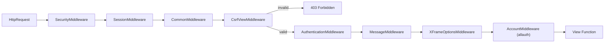
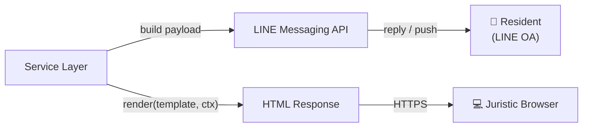
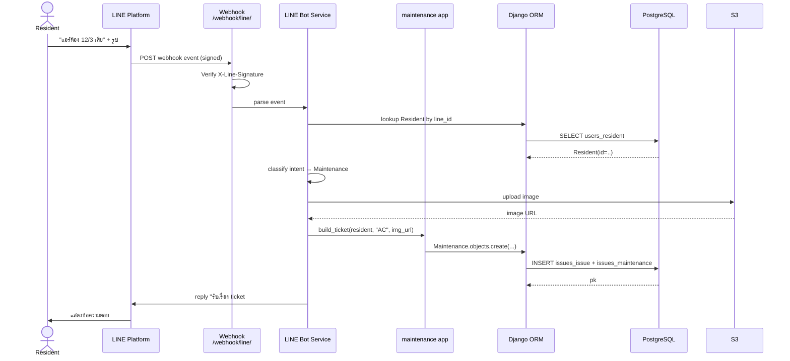
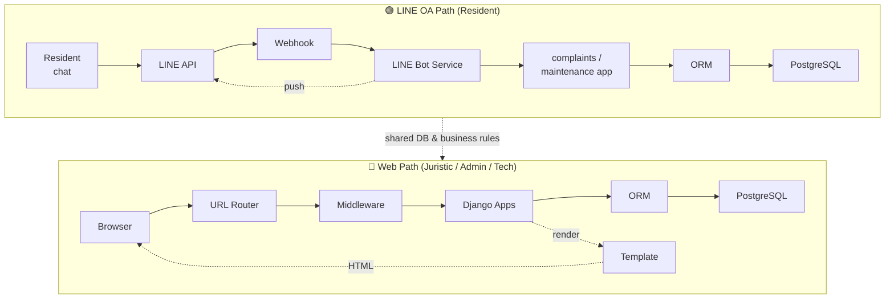

# BaanHao — System Architecture

> **End-to-End Layered**
> ระบบมี 2 ทางเข้า (LINE OA สำหรับลูกบ้าน + Web App สำหรับนิติบุคคล) มารวมกันที่ Django แล้ว flow ผ่าน layer เดียวกันจนถึง PostgreSQL บน Supabase
>
> **Stack:** Django 5.2 · django-allauth · PostgreSQL (Supabase) · S3 (boto3 + django-storages) · LINE Messaging API · gunicorn + whitenoise

---

## 1. Big Picture (Horizontal Pipeline)

```mermaid
flowchart LR
    %% ===== CLIENT LAYER =====
    subgraph CLIENTS["① CLIENT LAYER"]
        direction TB
        LineUser["📱 LINE OA<br/>(Resident)<br/>• FAQ<br/>• Submit Ticket<br/>• Receive Push"]
        Browser["💻 Web Browser<br/>(Juristic / Admin / Tech)<br/>• Dashboard<br/>• Tasks<br/>• Notice / Event"]
    end

    %% ===== GATEWAY =====
    subgraph GATEWAY["② GATEWAY LAYER"]
        direction TB
        LineAPI["LINE Messaging API<br/>(External)"]
        Webhook["POST /webhook/line/<br/>(Webhook Handler)"]
        URLRouter["Django URL Router<br/>(urls.py)"]
    end

    %% ===== MIDDLEWARE =====
    subgraph MIDDLEWARE["③ MIDDLEWARE PIPELINE<br/>(Chain of Responsibility)"]
        direction TB
        MW1["Security · Session · CSRF"]
        MW2["Auth · Messages · Allauth"]
        MW1 --> MW2
    end

    %% ===== APPLICATION =====
    subgraph APP["④ APPLICATION LAYER<br/>(Django Apps · MTV Views)"]
        direction TB
        AppUsers["users<br/>auth · roles · OAuth"]
        AppIssues["issues / complaints / maintenance<br/>ticket lifecycle"]
        AppNotif["notifications<br/>broadcast · targeted"]
        AppDash["dashboard / analytics<br/>aggregate · KPIs"]
        AppProps["properties<br/>House · Vehicle"]
    end

    %% ===== SERVICE =====
    subgraph SERVICE["⑤ SERVICE LAYER"]
        direction TB
        BotSvc["LINE Bot Service<br/>• Intent / FAQ matcher<br/>• Ticket builder<br/>• Reply formatter"]
        NotifSvc["Notification Dispatcher<br/>• Web alert<br/>• LINE push"]
        AuthSvc["Auth + Adapter<br/>(allauth + Custom Adapter)"]
        TmplSvc["Template Engine<br/>(base.html composite)"]
    end

    %% ===== DATA ACCESS =====
    subgraph DATA["⑥ DATA ACCESS LAYER"]
        direction TB
        ORM["Django ORM<br/>QuerySet · Managers"]
        Storage["django-storages + boto3<br/>(Media → S3)"]
    end

    %% ===== PERSISTENCE =====
    subgraph DB["⑦ PERSISTENCE LAYER"]
        direction TB
        PG["🐘 PostgreSQL<br/>(Supabase · SSL · :6543)"]
        S3["☁️ S3 Bucket<br/>profile / complaint / maintenance images"]
        Static["📦 Static<br/>(whitenoise)"]
    end

    %% ===== OUTPUT =====
    subgraph OUT["⑧ OUTPUT"]
        direction TB
        LineReply["LINE Reply / Push<br/>→ Resident"]
        HtmlResp["HTML Response<br/>→ Juristic Browser"]
    end

    %% --- Flow: Resident via LINE ---
    LineUser -->|"message / postback"| LineAPI
    LineAPI -->|"webhook event"| Webhook
    Webhook --> MIDDLEWARE

    %% --- Flow: Juristic via Web ---
    Browser -->|"HTTPS request"| URLRouter
    URLRouter --> MIDDLEWARE

    %% --- Common downstream ---
    MIDDLEWARE --> APP
    APP --> SERVICE
    SERVICE --> DATA
    DATA --> DB

    %% --- Outbound ---
    SERVICE -. "Reply / Push" .-> LineAPI
    LineAPI -. "deliver" .-> LineReply
    SERVICE -. "render template" .-> HtmlResp
    LineReply --> LineUser
    HtmlResp --> Browser

    %% --- Styling ---
    classDef client fill:#E8F5E9,stroke:#43A047,stroke-width:2px,color:#000
    classDef gateway fill:#FFF3E0,stroke:#FB8C00,stroke-width:2px,color:#000
    classDef middleware fill:#F3E5F5,stroke:#8E24AA,stroke-width:2px,color:#000
    classDef app fill:#FFEBEE,stroke:#E53935,stroke-width:2px,color:#000
    classDef service fill:#E3F2FD,stroke:#1E88E5,stroke-width:2px,color:#000
    classDef data fill:#FFFDE7,stroke:#FBC02D,stroke-width:2px,color:#000
    classDef db fill:#ECEFF1,stroke:#455A64,stroke-width:2px,color:#000
    classDef out fill:#EDE7F6,stroke:#5E35B1,stroke-width:2px,color:#000

    class LineUser,Browser client
    class LineAPI,Webhook,URLRouter gateway
    class MW1,MW2 middleware
    class AppUsers,AppIssues,AppNotif,AppDash,AppProps app
    class BotSvc,NotifSvc,AuthSvc,TmplSvc service
    class ORM,Storage data
    class PG,S3,Static db
    class LineReply,HtmlResp out
```



---

## 2. Layer-by-Layer Summary

| # | Layer | Responsibility | Components | Tech / Files |
|---|-------|----------------|------------|--------------|
| ① | **Client** | จุดที่ user สัมผัสระบบ | LINE OA (Resident), Web Browser (Juristic / Tech / Admin) | LINE Official Account, HTML / CSS / JS templates |
| ② | **Gateway** | รับ traffic จากภายนอก แปลงเป็น Django request | LINE Webhook endpoint, URL Router, OAuth callback | `urls.py`, `users/urls.py`, `webhook/line/` *(planned)* |
| ③ | **Middleware** | Cross-cutting: security, session, CSRF, auth, flash, allauth | 8 middleware ตามลำดับ | `MIDDLEWARE` ใน `settings.py` |
| ④ | **Application** | Business logic แยกตาม domain (Django apps · MTV) | `users`, `issues`, `complaints`, `maintenance`, `notifications`, `properties`, `dashboard`, `analytics` | `apps/*/views.py`, `forms.py` |
| ⑤ | **Service** | Logic ที่ใช้ร่วมหลาย app + integration ออกนอกระบบ | LINE Bot Service, Notification Dispatcher, Auth Adapter, Template Engine | `users/adapters.py`, services *(planned)* |
| ⑥ | **Data Access** | แปลง object ↔ row, จัดการ media | Django ORM, QuerySet, django-storages | `models.py`, `boto3`, `django-storages` |
| ⑦ | **Persistence** | เก็บข้อมูลถาวร | PostgreSQL (Supabase), S3 bucket, static files | Supabase, AWS S3, whitenoise |
| ⑧ | **Output** | ส่งผลลัพธ์กลับไป client | LINE Reply / Push API, HTML response | LINE Messaging API, Django Template |

---

## 3. Layer Details

### ① Client Layer

| Channel | User Roles | Capabilities |
|---------|-----------|--------------|
| **LINE OA** | Resident | ถาม FAQ · ส่งเรื่องร้องเรียน (Complaint) · ส่งคำขอซ่อม (Maintenance / Smart Ticket) · รับ Push Notification |
| **Web Browser** | Juristic Officer · Admin · Technician | Dashboard, All Tasks (complaint + maintenance), Notice, Event, Staff Management, Analytics |

### ② Gateway Layer

ทั้ง 2 ทางถูก normalize เป็น Django `HttpRequest` ก่อนเข้า middleware

- **LINE Messaging API → Webhook:** LINE ยิง POST event มาที่ `/webhook/line/` *(planned)* พร้อม signature header — webhook handler ต้อง verify signature ด้วย `LINE_CHANNEL_SECRET` ก่อนแปลง event เป็น Django request payload
- **Browser → URL Router:** Request วิ่งผ่าน HTTPS (gunicorn) → URL pattern matching ใน `baanhao_project/urls.py` → กระจายไปยัง app URLs ด้วย `include()`
- **OAuth callback:** Google / LINE login redirect กลับมาที่ `/accounts/<provider>/callback/` ของ allauth

### ③ Middleware Pipeline (Chain of Responsibility)



> หมายเหตุ: LINE webhook ใช้ `@csrf_exempt` เพราะ LINE ไม่ส่ง CSRF token — ความปลอดภัยพึ่ง signature verification แทน

### ④ Application Layer (Django Apps)

| App | Responsibility | Key Models |
|-----|---------------|-----------|
| `users` | Authentication, registration approval flow, roles | `User` (AbstractUser), `Resident`, `Technician`, `JuristicOfficer`, `Security`, `Admin`, `RegistrationRequest` |
| `properties` | House & Vehicle registry | `House`, `Vehicle` |
| `issues` | Parent of complaint/maintenance, lifecycle | `Issue`, `IssueStatus` |
| `complaints` | Complaint ticket | `Complaint extends Issue` |
| `maintenance` | Maintenance request + technician assignment | `Maintenance extends Issue` |
| `notifications` | In-system notice + LINE push trigger | `Notification` |
| `dashboard` | Landing + KPI overview | view-only |
| `analytics` | Reports, charts, resolution time | view-only |

### ⑤ Service Layer

โมดูลที่ยังออกแบบไว้ (มาร์ค *planned* คือยังไม่อยู่ในโค้ดวันนี้):

| Service | Purpose | Inputs | Outputs |
|---------|---------|--------|---------|
| **LINE Bot Service** *(planned)* | แปลง LINE event เป็น action ในระบบ | webhook payload | reply text / flex message |
| **Intent / FAQ matcher** *(planned)* | จับ keyword หรือ postback → เลือก handler | message text / postback data | handler name + extracted params |
| **Ticket Builder** *(planned)* | สร้าง `Complaint` / `Maintenance` จากบทสนทนา LINE | resident id + category + description + image | Issue row |
| **Notification Dispatcher** *(planned)* | ส่ง notification ทั้งใน web และ LINE push | recipient list + message | LINE push API call + `Notification` row |
| **Auth Adapter** | จัดการ social login flow แบบ approval-based | OAuth callback | redirect to dashboard / pending screen |
| **Template Engine** | Render HTML จาก `base.html` + child templates | context dict | HTML response |

### ⑥ Data Access Layer

- **ORM (Django):** Facade ครอบ SQL — เขียน `.filter().select_related().order_by()` แล้ว ORM gen SQL ให้
- **QuerySet:** Lazy (Proxy pattern) + chainable (Builder)
- **Model Managers:** `.objects.filter(...)`, `.objects.exclude(...)` ทำหน้าที่ entry point
- **Media Storage:** `django-storages` + `boto3` อัปโหลดไฟล์ (profile, complaint evidence, maintenance before/after) ขึ้น S3

### ⑦ Persistence Layer

| Store | Used For | Config |
|-------|----------|--------|
| **PostgreSQL (Supabase)** | All relational data | Port `6543`, SSL required, credentials ใน `.env` |
| **S3 Bucket** | User-uploaded images | `boto3` + `django-storages`, credentials ใน `.env` |
| **Whitenoise** | Static files (CSS/JS/img) | Served via WSGI |

### ⑧ Output



- **LINE side:** Reply (sync ตอบ webhook event) หรือ Push (async จาก backend) — ใช้ Bearer token `LINE_CHANNEL_ACCESS_TOKEN`
- **Web side:** HTML render โดย Django template engine, static asset เสิร์ฟผ่าน whitenoise

---

## 4. End-to-End Sequence — LINE OA Flow

ตัวอย่าง: Resident ส่งข้อความ "แอร์เสีย" ผ่าน LINE → ระบบสร้าง Maintenance ticket → push ยืนยันกลับ



---

## 5. End-to-End Sequence — Juristic Web Flow

ตัวอย่าง: Juristic officer login → เปิดหน้า All Tasks → กดเปลี่ยน status → ระบบส่ง push แจ้ง resident

```mermaid
sequenceDiagram
    actor J as Juristic Officer
    participant B as Browser
    participant MW as Middleware Chain
    participant V as issues.views<br/>all_tasks / maintenance_detail
    participant ORM as Django ORM
    participant DB as PostgreSQL
    participant ND as Notification Dispatcher
    participant LA as LINE Messaging API
    participant R as Resident (LINE)

    J->>B: POST /users/login/
    B->>MW: HTTPS request
    MW->>V: routed (authenticated)
    V->>ORM: authenticate(username, pw)
    ORM->>DB: SELECT user
    DB-->>V: user row
    V-->>B: Session cookie + redirect /dashboard
    J->>B: GET /all_tasks/
    B->>MW: HTTPS request
    MW->>V: all_tasks(request)
    V->>ORM: Issue.objects.select_related(reporter).order_by(-created)
    ORM->>DB: SELECT JOIN
    DB-->>V: tasks
    V-->>B: render all_tasks.html
    J->>B: POST status=complete (maintenance_detail)
    B->>MW: HTTPS
    MW->>V: maintenance_detail
    V->>ORM: task.status = SUCCESS; save()
    ORM->>DB: UPDATE issues_issue
    V->>ND: notify(resident, "งานซ่อมเสร็จ")
    ND->>DB: INSERT notifications_notification
    ND->>LA: push to resident.line_id
    LA->>R: 🔔 push message
```

---

## 6. Data Flow Across Layers (Two-Path View)



ทั้ง 2 path ลง PostgreSQL ตัวเดียวกันและใช้ Model + business rule ชุดเดียวกัน — Juristic เห็น ticket ที่ลูกบ้านส่งจาก LINE ในหน้า All Tasks ทันที, action ของ Juristic ก็ trigger LINE push กลับไปหา Resident ได้

---

## 7. Configuration & Secrets

| Variable | Layer | Purpose |
|----------|-------|---------|
| `DJANGO_SECRET_KEY` | Application | Session signing |
| `DB_NAME` / `DB_USER` / `DB_PASSWORD` / `DB_HOST` / `DB_PORT` | Persistence | Supabase PostgreSQL connection |
| `AWS_ACCESS_KEY_ID` / `AWS_SECRET_ACCESS_KEY` / `AWS_STORAGE_BUCKET_NAME` | Persistence | S3 media uploads |
| `LINE_CHANNEL_SECRET` *(planned)* | Gateway | Verify webhook signature |
| `LINE_CHANNEL_ACCESS_TOKEN` *(planned)* | Service / Output | Send reply / push |
| Google OAuth client id/secret | Service (Auth) | django-allauth Google provider |
| LINE OAuth client id/secret | Service (Auth) | django-allauth LINE provider (login only, แยกจาก Messaging API) |

> ⚠️ LINE OAuth login (ปัจจุบันมีในโค้ดผ่าน `users/adapters.py`) แยกจาก LINE Messaging API (ที่จะใช้สำหรับ FAQ/ticket/push) — เป็นคนละ channel กันในฝั่ง LINE Developer Console

---

## 8. Mapping ไปยังเอกสารเชิงลึกอื่น

- **Design Patterns ในระบบ** → ดู [`ARCHITECTURE.md`](./ARCHITECTURE.md) (Singleton, Factory, Adapter, Facade, Composite, Decorator, Proxy, Strategy, Template Method, Chain of Responsibility, Command, Iterator, State)
- **DB Schema (SQL)** → [`DDL.sql`](./DDL.sql)
- **Project structure** → README.md ระดับ root
